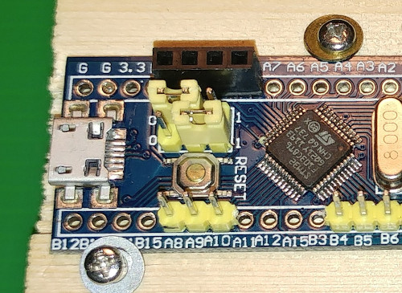

# Logging Pill
is a simple, low cost (~USD6), open source environmental data logger built
around the BME280 sensor module (temperature, barometric pressure,
and relative humidity) and the STM32F103 Blue Pill stamp.  Both of
these are available off the shelf, so no custom PCBs are needed.
Data are saved to the F103's own flash, so not even an SD card
is needed.  There is enough space for at least 11,000 records,
which translates to 4 months duration if logging every 15 minutes.

This document describes how to assemble the electronics (you'll
need to know how to solder), how to upload the programming, and
how to use the logger.  The enclosure to put it in is up to you!

## Hardware
1. Blue Pill board, STM32F102C8T6, [an example](https://www.aliexpress.com/item/32326304541.html).
2. BME280 sensor module,
[an example](https://www.aliexpress.com/item/4001098967210.html).  There
are different modules out there; get the one with 2 mounting holes
and 6 pins, which does not have an onboard voltage regulator,
instead of the one with 1 mounting hole and 4 pins, which does. You
can get the BMP280 instead, which is much cheaper and lacks relative
humidity, if that is not needed for your purpose.  But make sure
you do not buy this accidentally!  They look very very similar.
3. USB-serial adapter, for programming the chip, and downloading
data.  Only 1 is needed regardless of how many loggers you make.
I use the [CH340](https://www.aliexpress.com/item/1005001552181234.html),
but there are others like PL2302, FT232RL,
CP2102.  But make sure you can set it to communicate at 3.3
volts (they will all do 5 volts which we cannot use).
4. 3-core cable for the USB-serial adapter,
[an example](https://www.aliexpress.com/item/32633633708.html),
terminated at both ends with female 1x3 Dupont connectors,
2-3 feet long.  Only 1 needed.
5. 1x4 female header, 100 mil (0.1 inch/2.54mm) pitch,
[an example](https://www.aliexpress.com/item/32821638049.html).
6. 2xAA (or 2xAAA if you are severely space constrained) battery
holder,
[an exmaple](https://www.aliexpress.com/item/32818907820.html), with
appropriate cells.
7. Some heat shrink tubing, 1.5mm.
8. White paint marker.
9. Soldering equipment and supplies.

It's a good idea to buy 2 of everything even if you only want 1
logger.  It's cheap enough and helps in debugging problems.

## Assembly
(The photos show an additional 5-pin male header soldered on the F103
stamp; ignore this!)

### Programming/serial header

This is a 3-pin male header soldered to A8,
A9, and A10, pointing upwards.  You can use the male headers that
come with the F103 stamp.  Solder one pin first and ensure it is
straight before doing the others.  It's almost impossible to adjust
the alignment of the header after all the pins are soldered in.

On the reverse side of the F103 stamp, solder a jumper wire from
pin A8 to and ground pin.  Mark A8 (ground) with the paint marker.

Connect the 3-core cable to the USB-serial adapter and rearrange
the pins on the free end such that they will be in the order
ground, adapter-tx, adapter-rx.  Mark the ground end with the
paint marker, so that the orientation with the 3-pin male header
on the F103 stamp is unmistakeable.

### BME280 module
[BME280 module attached](pics/1-ready)
Solder a 4-pin male header to the bottom of the module board
(NOT the component side).
The module has space for 6 pins; do not occupy CSB and SDO, only VCC, GND,
SCL, and SDA.

### BME280 female header
Solder the 4-pin female header to the STM32 stamp component side
(top) at pins B0, B1, B10, and B11.

### Battery holder
Solder the battery holder leads, red/positive to the location
marked 3.3, and the black/negative to the location marked G next
to 3.3.  There are 2 such pairs; I chose the pair closest to the
4-pin 90-degree debug header in order to use the header as
strain relief for the holder leads.

### Remove power LED (optional)

There are 2 LEDs on the board, one marked PWR (red) and the
other marked PC13 (green).  You can temporarily power on the
stamp to identify the power LED if you are unsure.

Removing this power LED is a little tricky.  If you do not remove it,
the power drain will be higher, but if you intend to run the
logger only at high sample rates (say every couple of seconds),
then it might be ok to leave the LED alone.

An easy to achieve this is to melt a solder blob (normal leaded solder)
onto one end of the LED, then stretch the blob to the other end.
The blob needs to be big enough for this to happen.  When both ends
are thus engulfed by solder, go in with your stainless steel pointy
tweezers and pick up the LED.  Then wick up the solder if it
bridges the LED pads.

After removing the LED, you MUST clean the area with an old tooth
brush and isopropyl alcohol or a commercial flux remover.
Dab the area dry with lint-free tissue.  You'll need to repeat this
a few times to get it clean.  If you do not clean this area, the
crystal (black rectangle next to the LED) may later refuse to
start oscillating due to conductivity between the pins.

## Programming

After the hardware has been assembled, you'll want to upload the file
    bme280-pill.bin
to the F103.
You'll have to first move the jumpers on the F103 stamp into the
correct position, before powering on the stamp 
(or pressing the reset button).  The BME280
module does not need to be attached, but the batteries need to
be installed to power the stamp.

After programming, move the jumpers to the run position.

(Actually you can put both jumpers in the low position and that
would work ok too; but this way results in a slightly lower
power consumption).
Reinstall the BME280 module and power cycle or hit reset.

### Linux/Ubuntu, or Mac
I use [stm32flash](https://github.com/stm32duino/stm32flash).
You can invoke is as:
    stm32flash -w bme280-pill.bin /dev/ttyUSB0
(or whatever port the serial adapter enumerates as).
There is a
    make
target too, so you can do:
    $ make bme280-pill.stm32flash

### Windows
You'll want to download
[STSW-LINK004](https://www.st.com/en/development-tools/stm32cubeprog.html)
a nice GUI programmer from ST, to do the job.

## Compiling
You don't need to compile the code because a pre-compiled image
is included as
    bme280-pill.bin.
But if you want to anyway, you'll need a recent
    arm-none-eabi-gcc
and toolchain.

You'll also need
    libopencm3
available on [github](https://github.com/libopencm3/libopencm3).
Code is GPLv2.

## Running
The BME280 module must be connected to the 1x4 female header,
note the orientation.
Connect the serial adapter and cable.  On your PC you'll need to
run a terminal emulator.  On Ubuntu I like
    picocom
and on Windows the most popular option is
[PuTTY](https://www.chiark.greenend.org.uk/~sgtatham/putty/latest.html).
This has several comms options, you'll want to select `serial`
(not telnet or SSH).  You can also turn logging on.

Set your terminal emulator to 57600/8N1, no flow control.
Insert batteries (note polarity) and power on.

There is always a 4-second delay before the programme starts, then
a wait of a few seconds (it varies) for the real time clock
oscillator to start, if starting from cold.  Note that the green
LED is lit, which occurrs whenever the logger is not asleep.  It
goes off when the logger sleeps between logging events.

You'll then be dropped into a menu to set the logging parameters,
logging interval *i* (in seconds), filename *f*, and start time
*s* (which can be in the past).  If the logger was powered off,
you'll also need to set the clock time *T*.  When done, press *r*
to begin logging.  You can then disconnect the serial cable.

You can also set the start time to be way in the future, such that
all configuration and prep can be done in the lab and none need be
done by field personnel in the field.

To retrieve data, press the reset button to interrupt sleep, then
press any key when prompted so the logger presents you with the
menu instead of going into its logging cycle.

At the menu this time select *a* to display all the data.  If you had
set your terminal to log output, then the data would be automatically
captured.  Otherwise, you can copy/paste.

(There is a *d*ownload option, but this requires your terminal
emulator support YMODEM, which few Windows terminal emulators do.
Rumoured exceptions are HyperTerminal and ExtraPutty.  On Unix,
shell out of the terminal emulator or have it run
    rb -a

Now you can erase the data if desired (*E*).

Now if you hit *r* the logger will continue its logging cycle.  If
you want to change the logging parameters (such as logging
interval), you need to erase existing data first.

## Thanks
If you build this I would be interested in any feedback.  I know
it's a pain that the clock time is lost whenever power is
broken; that's a consequence of there not being a backup battery on
the stamp.  I am working on a workaround though.

If you need to log specific other parameters, let me know.  I
may be able to oblige.

Comments to htarold@gmail.com.
